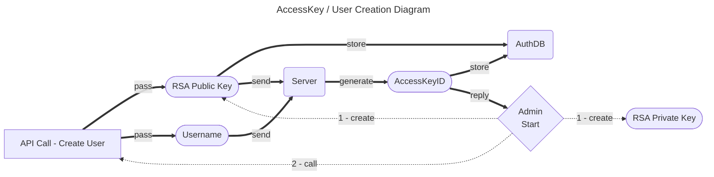
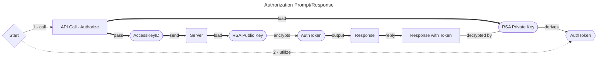
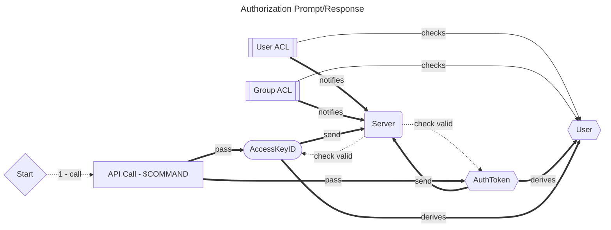

# Auth Steps

## Creation

 1. Person Create RSA Private/Public Keys
 2. Person Create User
    - Pass PubKey, Username as parameters
 3. Server
    - Generate AccessKeyId
    - Store AccessKeyID, PubKey
 4. Server Reply with AccessKeyID

## Authorization

 1. Person Authorize
    - Pass AccessKeyID as parameter
    - Client/API Requires PrivKey; Is **NOT** passed to Server
 2. Server
    - Check for valid AccessKeyID
    - Generate AuthToken
    - Using PubKey in AuthDB paired with AccessKeyID, Encrypt AuthToken
    - Send Encrypted AuthToken to Client/API
 3. Client/API Validate
    - Using PrivKey, Attempt decryption of Encrypted AuthToken
    - Send Decrypted AuthToken back to Server as Verification
 4. Server
    - Check for valid AccessKeyID
    - Check that AuthToken is valid (exists in AuthDB, not expired)
 5. Client/API Token Display
    - Provide Token to Person

## Commands

 1. Person Command
    - Pass AccessKeyId as Parameter
    - Pass AuthToken as Parameter
 2. Server
    - Check for valid AccessKeyID
    - Check that AuthToken is valid (exists in AuthDB, not expired)
    - Check for UACL, GACL Allowance
 3. Server Command Processing
 4. Response

