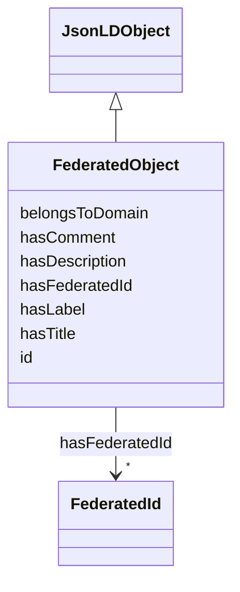

# Class: FederatedObject


URI: [fedid:FederatedObject](https://w3id.org/byon/fedid/v1.0/#FederatedObject)





## Inheritance
* [JsonLDObject](JsonLDObject.md)
    * **FederatedObject**


## Slots

| Name | Cardinality and Range | Description | Inheritance |
| ---  | --- | --- | --- |
| [hasFederatedId](hasFederatedId.md) | * <br/> [FederatedId](FederatedId.md) |  | direct |
| [belongsToDomain](belongsToDomain.md) | 1 <br/> [String](String.md) |  | direct |
| [id](id.md) | 1 <br/> [String](String.md) |  | [JsonLDObject](JsonLDObject.md) |
| [hasLabel](hasLabel.md) | * <br/> [String](String.md) |  | [JsonLDObject](JsonLDObject.md) |
| [hasDescription](hasDescription.md) | * <br/> [String](String.md) |  | [JsonLDObject](JsonLDObject.md) |
| [hasComment](hasComment.md) | * <br/> [String](String.md) |  | [JsonLDObject](JsonLDObject.md) |
| [hasTitle](hasTitle.md) | * <br/> [String](String.md) |  | [JsonLDObject](JsonLDObject.md) |


## Identifier and Mapping Information


### Schema Source


* from schema: https://w3id.org/byon/fedid/v1.0/


## Mappings

| Mapping Type | Mapped Value |
| ---  | ---  |
| self | fedid:FederatedObject |
| native | fedid:FederatedObject |


## LinkML Source

<!-- TODO: investigate https://stackoverflow.com/questions/37606292/how-to-create-tabbed-code-blocks-in-mkdocs-or-sphinx -->

### Direct

<details>
```yaml
name: FederatedObject
from_schema: https://w3id.org/byon/fedid/v1.0/
is_a: JsonLDObject
slots:
- hasFederatedId
- belongsToDomain
class_uri: fedid:FederatedObject

```
</details>

### Induced

<details>
```yaml
name: FederatedObject
from_schema: https://w3id.org/byon/fedid/v1.0/
is_a: JsonLDObject
attributes:
  hasFederatedId:
    name: hasFederatedId
    from_schema: https://w3id.org/byon/fedid/v1.0/
    rank: 1000
    slot_uri: fedid:hasFederatedId
    alias: hasFederatedId
    owner: FederatedObject
    domain_of:
    - FederatedObject
    range: FederatedId
    multivalued: true
  belongsToDomain:
    name: belongsToDomain
    from_schema: https://w3id.org/byon/fedid/v1.0/
    rank: 1000
    slot_uri: fedid:belongsToDomain
    alias: belongsToDomain
    owner: FederatedObject
    domain_of:
    - FederatedObject
    - DomainIdentifier
    range: string
    required: true
    multivalued: false
  id:
    name: id
    from_schema: https://w3id.org/byon/fedid/v1.0/
    rank: 1000
    slot_uri: jsonld:id
    identifier: true
    alias: id
    owner: FederatedObject
    domain_of:
    - JsonLDObject
    range: string
    required: true
  hasLabel:
    name: hasLabel
    from_schema: https://w3id.org/byon/fedid/v1.0/
    rank: 1000
    slot_uri: rdfs:label
    alias: hasLabel
    owner: FederatedObject
    domain_of:
    - JsonLDObject
    range: string
    multivalued: true
  hasDescription:
    name: hasDescription
    from_schema: https://w3id.org/byon/fedid/v1.0/
    rank: 1000
    slot_uri: dc:description
    alias: hasDescription
    owner: FederatedObject
    domain_of:
    - JsonLDObject
    range: string
    multivalued: true
  hasComment:
    name: hasComment
    from_schema: https://w3id.org/byon/fedid/v1.0/
    rank: 1000
    slot_uri: rdfs:comment
    alias: hasComment
    owner: FederatedObject
    domain_of:
    - JsonLDObject
    range: string
    multivalued: true
  hasTitle:
    name: hasTitle
    from_schema: https://w3id.org/byon/fedid/v1.0/
    rank: 1000
    slot_uri: dc:title
    alias: hasTitle
    owner: FederatedObject
    domain_of:
    - JsonLDObject
    range: string
    multivalued: true
class_uri: fedid:FederatedObject

```
</details>