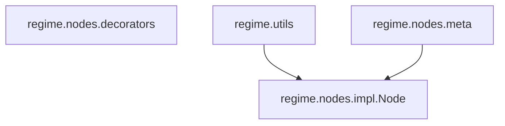
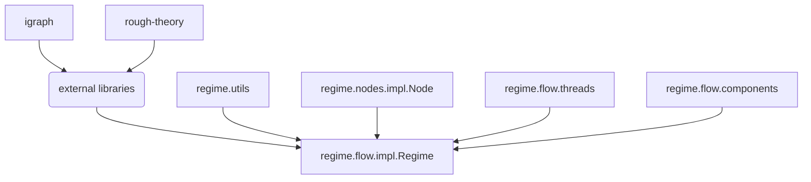

# regime: Workflow validation and inspection! :mag_right:
<a href="https://github.com/johnHostetter/regime/actions"></a>
<a href="https://github.com/johnHostetter/regime/actions"></a>
<a href="https://codecov.io/github/johnHostetter/regime"></a>
<a href="https://github.com/psf/regime"></a>
 
The `regime` library offers a precise framework to outline workflows consisting of classes, functions, and resources. The `Regime` class uses `Process` and `Resource` objects to delineate the flow of algorithms and input or output byproducts. `Process` objects, if inheriting from `HyperparameterMeta`, can explicitly "tag" hyperparameters by using the `hyperparameter` decorator; this allows for the clear separation of hyperparameters such as those found in experiments (e.g., _alpha_, _beta_) and ordinary arguments (e.g., _dataset_). 

## Special features :high_brightness:
1. *Hyperparameter Recognition*: We can always automatically determine what are the hyperparameters from a `Process` signature. In doing so, this allows us to know which arguments we can safely explore other values.
2. *Hyperparameter Validation*: Keeping up with hyperparameters for many processes can quickly become cumbersome - especially in complex workflows. To address this - `Regime` determines what hyperparameters must be defined to use the required `Process` objects, and checks that these are provided via a `dict` instance. This `dict` follows a hierarchical structure that comes directly from Python modules' paths to ensure that hyperparameters remain unique and their purpose known (i.e., they are nested according to the exact location they are found).
3. *Hyperparameter Logging*: Often, hyperparameters require _fine-tuning_, and after an experiment is performed - if the results are ideal, we wish to store these values for later reuse. The hyperparameters used for a `Regime` object can easily be exported as .yaml files.
4. *Workflow Visualization*: Due to `Regime`'s backend graph to implement the flow of data between `Process` instances, your program's workflow is readily able to be visualized by using the `igraph` library! This allows you to dynamically create diagrams showcasing how your program's functions, classes, resources, etc. all interact with each other, and can serve as a form of additional real-time documentation (e.g., PDF file).
5. *Process Inspection*: The `Regime` class inherits from the features implemented in the `rough-theory` library. This enables `Regime` instances to leverage operations analyzing discernibility for complex analysis of workflows.

Incorporating `regime` into your code is straightforward and requires minimal edits! 

## Example Illustration of a Regime :camera:


## Project Structure :file_folder:
The `regime` library is structured as follows:
```bash
src
├── regime
│   ├── __init__.py
│   ├── utils.py (misc. generic utils)
│   ├── flow
│   │   ├── __init__.py
│   │   ├── components.py (Process and Resource namedtuples)
│   │   ├── threads.py (ComponentThread class)
│   │   ├── impl.py (Regime class)
│   ├── nodes
│   │   ├── __init__.py
│   │   ├── decorators.py (hyperparameter decorator)
│   │   ├── impl.py (Node class)
│   │   ├── meta.py (HyperparameterMeta class)
├── tests
│   ├── __init__.py
│   ├── test_regime.py
│   ├── test_component_thread.py
│   ├── test_configuration.py
│   ├── submodule.py
```
## Dependencies :link:
### The Node Class
The `regime` library uses the class `Node` to structure the workflow of the program. The `Node` 
class provides an interface for code to readily interact and be managed by the `Regime` class. The 
`Node` class is to be inherited by other classes that the user is interested in using within a 
`Regime` object.

Note that `regime.nodes.decorators` is an isolated script from the rest of the `regime` library. It 
is used to provide the `hyperparameter` decorator, which is used to tag hyperparameters in `Node` 
classes/objects.

Overall, most user needs are met by the `Node` class as well as the `hyperparameter` decorator. The 
other code is meant for internal use and is not intended to be used by the user.

### The Regime Class
The `Regime` class is the central component of the `regime` library. It is responsible for managing 
the flow of data between `Process` instances, and ensuring that the hyperparameters required by 
each `Process` are provided. The `Regime` class is also responsible for generating the graph that 
represents the workflow of the program. 

The `Regime` class uses the following dependencies:

The `Regime` inherits from a `rough-theory` class to provide additional features for analyzing 
workflows (advanced use cases such as quantifying discernibility). The `Regime` class also uses 
the `igraph` library to generate the graph (accessed via `rough-theory`'s class) that represents 
the workflow of the program. Since a `Regime` object contains a `igraph.Graph` object, the `Regime`
can be readily visualized by using the `igraph` library.

### Processes and Resources
The `Process` and `Resource` are `namedtuples` used to ensure that callables 
(e.g., functions, Nodes) and resources (e.g., files, directories, data) are properly managed by the
`Regime` by providing a consistent interface.

It is often expected that a `Node` class _will produce_ a `Resource` object as output. This
`Resource` object can then be used as input for another `Node` class. To ensure proper flow of 
resources, the `resource_name` is used to identify these resources and should be unique for each 
object inheriting from the `Node` class (or in general, any object that produces a `Resource` 
object).
